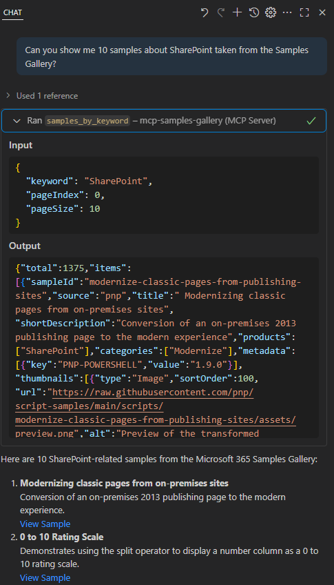

# Microsoft 365 Galleries MCP Servers

MCP Servers for the Microsoft 365 & Power Platform Community Samples Gallery.

## Overview

This repository contains two implementations of the same Model Context Protocol (MCP) Server that provides access to the Microsoft 365 & Power Platform Community Samples Gallery. 

Both projects expose identical functionality but use different communication protocols:

## Projects

### 1. SampleGalleriesMCPServerStdio
- **Protocol**: STDIO (Standard Input/Output)
- **Use Case**: Ideal for local development and integration with tools that support STDIO-based MCP servers
- **Communication**: Uses standard input/output streams for message exchange

### 2. SampleGalleriesMCPServerHttp
- **Protocol**: HTTP Streaming
- **Use Case**: Perfect for web-based applications and services that require HTTP-based communication
- **Communication**: Uses HTTP streaming for real-time message exchange

You can consume this MCP server over HTTP at the following public URL: [https://m365-galleries-mcp-edaufudugfc4c8hy.centralus-01.azurewebsites.net](https://m365-galleries-mcp-edaufudugfc4c8hy.centralus-01.azurewebsites.net).

## Functionality

Both MCP servers provide the same core functionality through the following tools:

### Available MCP Tools

#### 1. `SamplesByProduct`
Retrieves samples filtered by a specific Microsoft 365 or Power Platform product.

**Input Arguments:**
- `product` (string, required): The product identifier to filter samples (e.g., "SharePoint", "Teams", "Power Apps")
- `pageIndex` (int, required): The page number for pagination (starting from 1)
- `pageSize` (int, required): Number of samples to return per page

#### 2. `SamplesByAuthor`
Retrieves samples created by a specific author.

**Input Arguments:**
- `author` (string, required): The author identifier to filter samples
- `pageIndex` (int, required): The page number for pagination (starting from 1)
- `pageSize` (int, required): Number of samples to return per page

#### 3. `SamplesByKeyword`
Searches for samples using keyword-based text search.

**Input Arguments:**
- `keyword` (string, required): The search keyword or phrase to find in sample titles, descriptions, or metadata
- `pageIndex` (int, required): The page number for pagination (starting from 1)
- `pageSize` (int, required): Number of samples to return per page

#### 4. `SearchSamples`
Performs advanced search with comprehensive filtering, sorting, and pagination options.

**Input Arguments:**
- `search` (SearchSamples object, required): Complex search parameters including:
  - **Filter** (optional): Advanced filtering options
    - `Search` (string): Text to search across all sample content
    - `ProductId` (string array): Array of product identifiers to filter by
    - `AuthorId` (string): Specific author identifier
    - `CategoryId` (string): Category identifier for filtering
    - `FeaturedOnly` (boolean): Return only featured samples
    - `Metadata` (array): Additional metadata-based filters with key-value pairs
  - **Sort** (optional): Sorting configuration
    - `Field` (enum): Sort by Title, CreationDateTime, or UpdateDateTime
    - `Descending` (boolean): Sort in descending order if true
  - **Pagination** (optional): Pagination settings
    - `Index` (int): Page number (starting from 1)
    - `Size` (int): Number of items per page (default: 20)

### Sample Data Structure

Each sample returned contains comprehensive information including:
- Sample ID, name, version, and title
- Short description and source information
- Download URL and sample URL
- Associated products and categories
- Author information and creation/update timestamps
- Thumbnails and preview images
- Metadata tags and references
- Featured status and tracking information

## Getting Started

Choose the implementation that best fits your integration needs:
- Use **SampleGalleriesMCPServerStdio** for command-line tools and local development
- Use **SampleGalleriesMCPServerHttp** for web applications and HTTP-based integrations

Both servers connect to the same Microsoft 365 & Power Platform Community Samples Gallery API and provide identical data and functionality.
